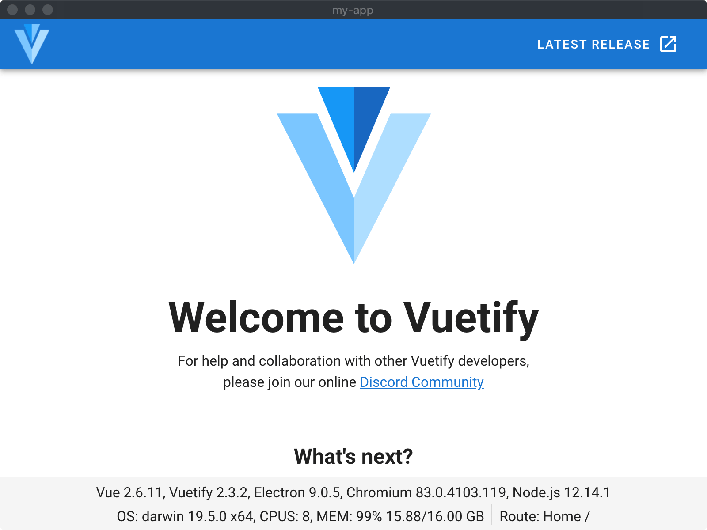

# Start [Electron]

[Electron]: https://www.electronjs.org/

## Environment

* [Node.js](https://nodejs.org/en/download/) = Latest LTS Version: 12.18.1
  * `Latest Current Version: 14.4.0` is not recommended at present, since Electron v9 is still using Node.js v12.
* [淘宝 NPM 镜像](https://developer.aliyun.com/mirror/NPM)

## Tutorial

* [Electron Quick Start](docs/tutorial/1_electron-quick-start.md)
* [Electron Fiddle](docs/tutorial/2_electron-fiddle.md)
* [Electron Forge](docs/tutorial/3_electron-forge.md)
* [Electron Vue](docs/tutorial/4_electron-vue.md)
* [Electron App with Vue.js, Vuetify](docs/tutorial/5_electron-app.md) ✨
  * [Electron: 如何以 Vue.js, Vuetify 开始应用](https://mp.weixin.qq.com/s/rFk-dgufsxeyhTe3vk-aLQ)

### Electron App with Vue.js, Vuetify ✨

## References

* [Electron Documentation](https://www.electronjs.org/docs)
* [Electron 9.0.0](https://www.electronjs.org/blog/electron-9-0)
* [Awesome Electron](https://github.com/sindresorhus/awesome-electron)
