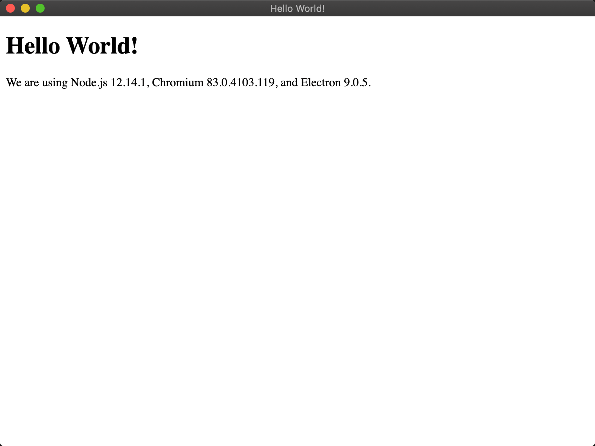

# [Electron Quick Start](https://github.com/electron/electron-quick-start)

```bash
# git submodule add https://github.com/electron/electron-quick-start samples/electron-quick-start

git clone --recurse-submodules -j git@github.com:ikuokuo/start-electron.git
cd start-electron/

cd samples/electron-quick-start/

export ELECTRON_MIRROR="https://cdn.npm.taobao.org/dist/electron/"
cnpm install
cnpm start
```


