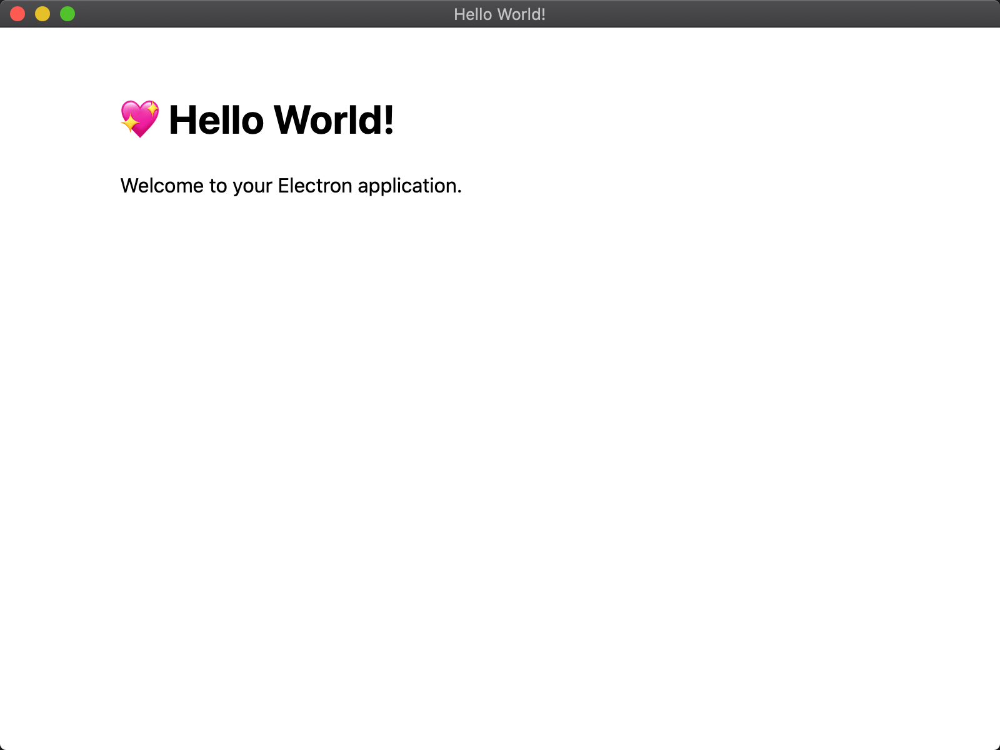

# [Electron Forge](https://github.com/electron-userland/electron-forge)

```bash
npm config set registry https://registry.npm.taobao.org

npx create-electron-app samples/my-new-app --template=typescript-webpack

cd samples/my-new-app
npm start
```



## Issues

### error TS2689: Cannot extend an interface 'NodeJS.EventEmitter'

```bash
error TS2689: Cannot extend an interface 'NodeJS.EventEmitter'. Did you mean 'implements'?
```

Solution:

```bash
# 1. Install Node.js = Latest LTS Version: 12.18.1
#    Since Electron v9 is still using Node.js v12
# 2. Remove npm cache
rm -r ~/.npm/.cache/
# 3. Remove app and create again
rm -r samples/my-new-app
```

* [electron.d.ts does not work with @types/node v13.1.0](https://github.com/electron/electron/issues/21612)
