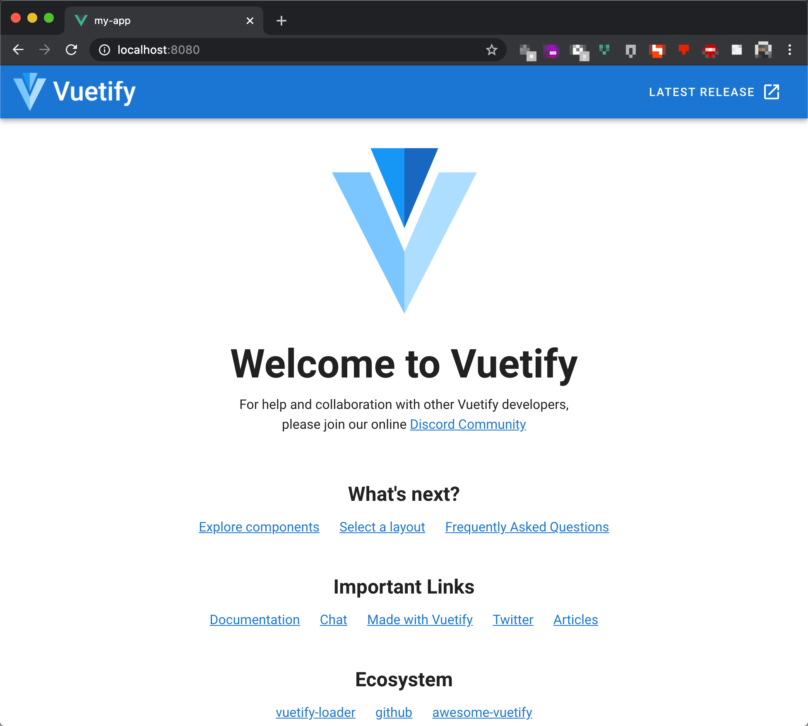
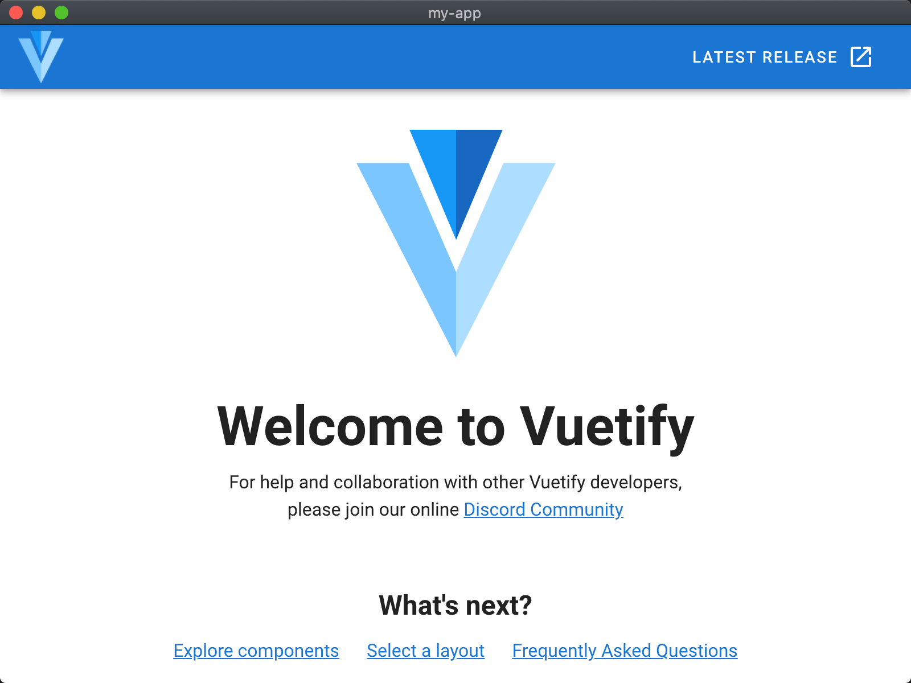
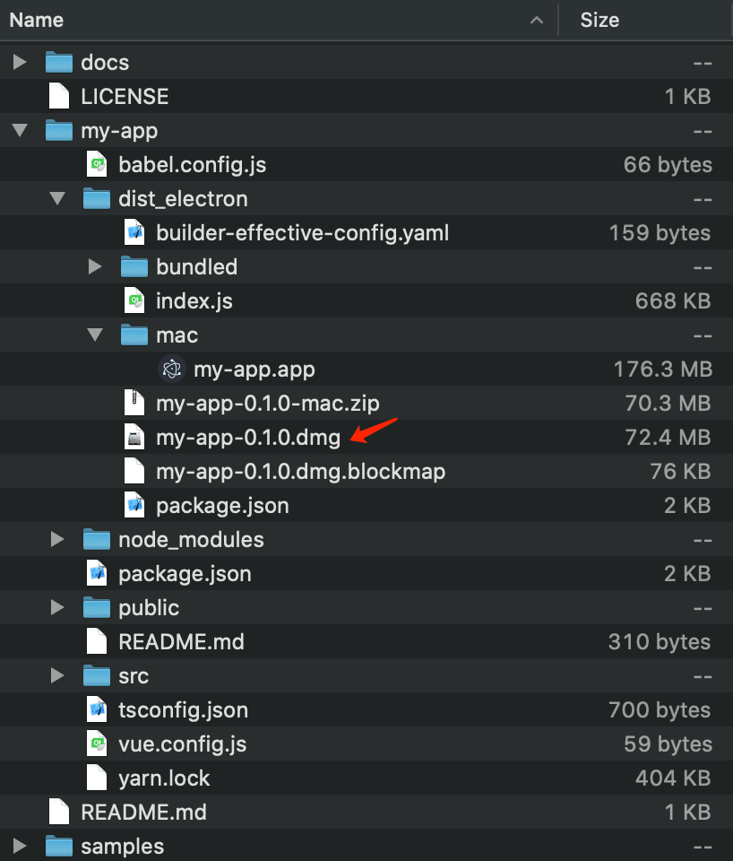

# Electron App with Vue.js, Vuetify

## Preparation

### Visual Studio Code

Download here: https://code.visualstudio.com/.

```bash
$ code -v
1.46.1
cd9ea6488829f560dc949a8b2fb789f3cdc05f5d
x64
```

Install extensions:

* ESLint
* Prettier - Code formatter
* Vetur
* Vue 2 Snippets (Optional to see snippets)

### Node.js

Download here: https://nodejs.org/en/download/.

It's recommended to select `Latest LTS Version`, since Electron v9 is still using Node.js v12.

```bash
$ node -v
v12.18.1

$ npm -v
6.14.5
```

### Yarn

GitHub: https://github.com/yarnpkg/yarn

```bash
npm config set registry https://registry.npm.taobao.org
npm install -g yarn
```

```bash
$ yarn -v
1.22.4
```

### Vue CLI

GitHub: https://github.com/vuejs/vue-cli

```bash
yarn global add @vue/cli
```

```bash
$ vue -V
@vue/cli 4.4.6
```

## Create a Vue.js App

```bash
vue create my-app
```

My setup:

```bash
Vue CLI v4.4.6
? Please pick a preset: Manually select features
? Check the features needed for your project: Babel, TS, Router, Vuex, Linter
? Use class-style component syntax? Yes
? Use Babel alongside TypeScript (required for modern mode, auto-detected polyfills, transpiling JSX)? Yes
? Use history mode for router? (Requires proper server setup for index fallback in production) Yes
? Pick a linter / formatter config: Prettier
? Pick additional lint features: Lint on save
? Where do you prefer placing config for Babel, ESLint, etc.? In dedicated config files
? Save this as a preset for future projects? No
? Pick the package manager to use when installing dependencies: Yarn
```

```bash
$ cat ~/.vuerc
{
  "useTaobaoRegistry": true,
  "packageManager": "yarn"
}
```

Start the app:

```bash
cd my-app
yarn serve
```

Open `http://localhost:8080/` in your browser:


## Optimize the App

### Vuetify

GitHub: https://github.com/vuetifyjs/vuetify

```bash
cd my-app
vue add vuetify
```

My setup:

```bash
? Choose a preset: Default (recommended)
```

Edit `tsconfig.json`:

```json
{
  "compilerOptions": {
    ...
    "types": [
-      "webpack-env"
+      "webpack-env",
+      "vuetify"
    ],
    ...
  },
  ...
}
```

Start the app:

```bash
yarn serve
```

Open `http://localhost:8080/` in your browser:



#### Edit `tsconfig.json` to fix the following `ERROR`

```bash
ERROR in /Users/John/Codes/ikuokuo/start-electron/my-app/src/plugins/vuetify.ts(2,21):
2:21 Could not find a declaration file for module 'vuetify/lib'. '/Users/John/Codes/ikuokuo/start-electron/my-app/node_modules/vuetify/lib/index.js' implicitly has an 'any' type.
  Try `npm install @types/vuetify` if it exists or add a new declaration (.d.ts) file containing `declare module 'vuetify/lib';`
    1 | import Vue from "vue";
  > 2 | import Vuetify from "vuetify/lib";
      |                     ^
    3 |
    4 | Vue.use(Vuetify);
    5 |
```

### Electron

* Electron: https://github.com/electron/electron
* Vue CLI Plugin Electron Builder: https://github.com/nklayman/vue-cli-plugin-electron-builder

```bash
yarn add @types/node@12 --dev
```

```bash
cd my-app
vue add electron-builder
```

My setup:

```bash
? Choose Electron Version ^9.0.0
```

Edit `src/router/index.ts`:

```ts
...
const router = new VueRouter({
-  mode: "history",
+  mode: process.env.IS_ELECTRON ? "hash" : "history",
  base: process.env.BASE_URL,
  routes
});

export default router;
```

Start the app:

```bash
yarn electron:serve
```



Scripts defined in `package.json`:

```json
{
  ...
  "scripts": {
    "serve": "vue-cli-service serve",
    "build": "vue-cli-service build",
    "lint": "vue-cli-service lint",
    "electron:build": "vue-cli-service electron:build",
    "electron:serve": "vue-cli-service electron:serve",
    "postinstall": "electron-builder install-app-deps",
    "postuninstall": "electron-builder install-app-deps"
  },
  ...
}
```

`yarn` the script, another example:

```bash
$ yarn lint
yarn run v1.22.4
$ vue-cli-service lint
 DONE  No lint errors found!
✨  Done in 3.17s.
```

#### `yarn add @types/node@12 --dev` to fix the following `ERROR`

```bash
ERROR in /Users/John/Codes/ikuokuo/start-electron/my-app/node_modules/electron/electron.d.ts(1659,31):
1659:31 Cannot extend an interface 'NodeJS.EventEmitter'. Did you mean 'implements'?
...
```

#### Edit `src/router/index.ts` to fix the following `WARN`

```bash
 WARN  It is detected that you are using Vue Router. If you are using history mode, you must push the default route when the root component is loaded. Learn more at https://goo.gl/GM1xZG .
```

## Deploy the App

### Electron Builder

GitHub: https://github.com/electron-userland/electron-builder

```bash
export ELECTRON_MIRROR="https://cdn.npm.taobao.org/dist/electron/"

# How to Disable Code Signing During the Build Process on macOS
export CSC_IDENTITY_AUTO_DISCOVERY=false

cd my-app
yarn electron:build
```

Deploy `dmg` on macOS, for example:



#### `export CSC_IDENTITY_AUTO_DISCOVERY=false` to avoid the following `ERROR`

```bash
...
  • signing         file=dist_electron/mac/my-app.app identityName=gdb_codesign identityHash=BC899AF362F80B3FDB39F966A1601E2AFAFA100B provisioningProfile=none
(node:10223) UnhandledPromiseRejectionWarning: Error: Command failed: codesign --sign BC899AF362F80B3FDB39F966A1601E2AFAFA100B --force --timestamp --options runtime --entitlements /Users/John/Workspace/Codes/start-electron/my-app/node_modules/app-builder-lib/templates/entitlements.mac.plist /Users/John/Workspace/Codes/start-electron/my-app/dist_electron/mac/my-app.app/Contents/Frameworks/Electron Framework.framework/Versions/A/Helpers/chrome_crashpad_handler
error: The specified item could not be found in the keychain.
...
(node:10223) UnhandledPromiseRejectionWarning: Unhandled promise rejection. This error originated either by throwing inside of an async function without a catch block, or by rejecting a promise which was not handled with .catch(). To terminate the node process on unhandled promise rejection, use the CLI flag `--unhandled-rejections=strict` (see https://nodejs.org/api/cli.html#cli_unhandled_rejections_mode). (rejection id: 1)
(node:10223) [DEP0018] DeprecationWarning: Unhandled promise rejections are deprecated. In the future, promise rejections that are not handled will terminate the Node.js process with a non-zero exit code.
```

<!--
### Electron Forge

GitHub: https://github.com/electron-userland/electron-forge
-->

## References

* electron-app
  https://github.com/bromix/vue-examples/tree/master/electron-app
* start-electron
  https://github.com/ikuokuo/start-electron
* Electron
  https://www.electronjs.org/docs
    * Application Distribution
      https://www.electronjs.org/docs/tutorial/application-distribution
* Electron Builder
  https://www.electron.build/
    * Code Signing
      https://www.electron.build/code-signing
    * Notarize app for macOS
      https://github.com/electron-userland/electron-builder/issues/3870
